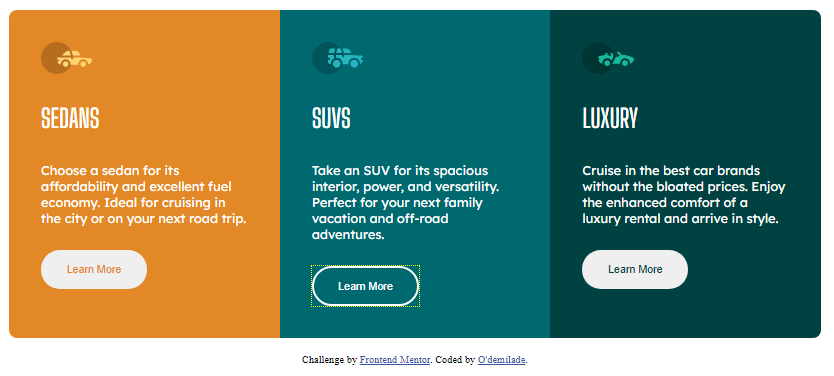

# Frontend Mentor - 3-column preview card component solution

This is a solution to the [3-column preview card component challenge on Frontend Mentor](https://www.frontendmentor.io/challenges/3column-preview-card-component-pH92eAR2-). Frontend Mentor challenges help you improve your coding skills by building realistic projects. 

## Table of contents

- [Overview](#overview)
  - [The challenge](#the-challenge)
  - [Screenshot](#screenshot)
  - [Links](#links)
- [My process](#my-process)
  - [Built with](#built-with)
  - [What I learned](#what-i-learned)
  - [Continued development](#continued-development)
  - [Useful resources](#useful-resources)
- [Author](#author)
- [Acknowledgments](#acknowledgments)

**Note: Delete this note and update the table of contents based on what sections you keep.**

## Overview

### The challenge

Users should be able to:

- View the optimal layout depending on their device's screen size
- See hover states for interactive elements

### Screenshot

### Links

- Solution URL: [GIT_O'demilade's 3_column_preview_card](https://github.com/O-demilade/3-column-preview-card)
- Live Site URL: [LIVE_O'demilade's 3_column_preview_card](https://odemilade-3column-preview-card.netlify.app)

## My process

### Built with

- Semantic HTML5 markup
- CSS custom properties
- CSS Grid
- Mobile-first workflow
- [Styled Components](https://styled-components.com/) - For styles

### What I learned

I now have a better understanding of frontend and CSS Grid

### Continued development

I will like to improve on my styling and adding appropriate tags and classes and also start looking into working with React.JS

### Useful resources

- [W3schools](https://w3schools.com/css) - This is usually the site I look out for first when I need to get a quick resource or syntax.

## Author

- Website - [I'm still designing this in my head :D](https://www.your-site.com)
- Frontend Mentor - [@o-demilade](https://www.frontendmentor.io/profile/O-demilade)
- Twitter - [@o_demilade_PK](https://www.twitter.com/o_demilade_PK)

## Acknowledgments

Thanks to W3Schools for the online resources and FrontendMentor for the challenges
